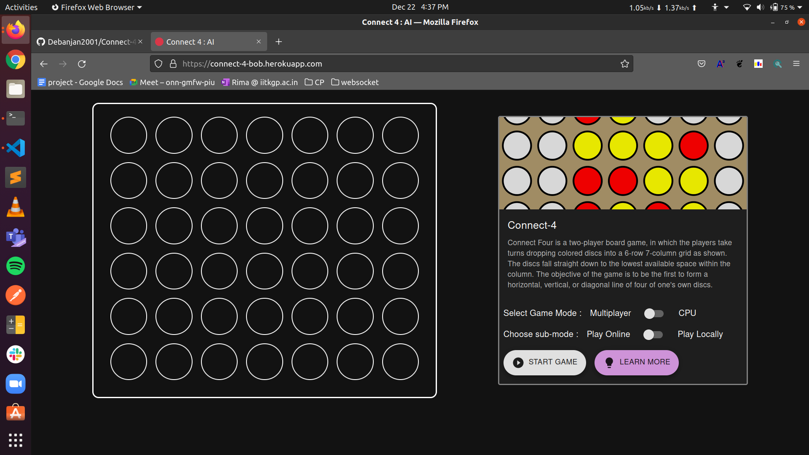

# Connect-4-AI

- A Game that you can play online, locally with a friend or against the Computer with 3 different difficulty levels. 
- Made with 💖 by Debanjan Saha

<hr>

## ~~Deployed with Heroku : [https://connect-4-bob.herokuapp.com/](https://connect-4-bob.herokuapp.com/)~~
## Deployed with DigitalOcean: [here](https://seal-app-aihn7.ondigitalocean.app/)




<hr>

## Previously Deployed Static Features with Netlify : [https://connect-4-bob.netlify.app/](https://connect-4-bob.netlify.app/)

<hr>

## Instructions to run locally (Written for Linux)

- Make sure you have node >= 14 and npm installed.
- Clone this Repository.
- Open the download location in a terminal.
- Run the following commands from either one of the methods.

### Method 1 (Directly served from the Build) :

- Make sure port <b>3001</b> is free before you run this

```
cd Connect-4-AI
npm install
npm install --prefix client && npm run build --prefix client
npm start
```
- Visit http://localhost:3001 and enjoy your day.

### Method 2 (Run in development mode) : 
```
cd Connect-4-AI
npm install
npm install --prefix client && npm run build --prefix client
touch .env
```
- Now paste the following in .env file
```
PORT=3001
DEVELOPMENT="true"
``` 
- Finally start the development server
- Make sure ports <b>3000  and 3001</b> are free before you run this :
```
npm run dev
```
- Visit http://localhost:3000 and enjoy your day.

### Method 3 (Docker) :
```
docker compose up
``` 

<hr>

# Getting Started with Create React App

This project was bootstrapped with [Create React App](https://github.com/facebook/create-react-app).

## Available Scripts

In the project directory, you can run:

### `npm start`

Runs the app in the development mode.\
Open [http://localhost:3000](http://localhost:3000) to view it in the browser.

The page will reload if you make edits.\
You will also see any lint errors in the console.

### `npm test`

Launches the test runner in the interactive watch mode.\
See the section about [running tests](https://facebook.github.io/create-react-app/docs/running-tests) for more information.

### `npm run build`

Builds the app for production to the `build` folder.\
It correctly bundles React in production mode and optimizes the build for the best performance.

The build is minified and the filenames include the hashes.\
Your app is ready to be deployed!

See the section about [deployment](https://facebook.github.io/create-react-app/docs/deployment) for more information.

### `npm run eject`

**Note: this is a one-way operation. Once you `eject`, you can’t go back!**

If you aren’t satisfied with the build tool and configuration choices, you can `eject` at any time. This command will remove the single build dependency from your project.

Instead, it will copy all the configuration files and the transitive dependencies (webpack, Babel, ESLint, etc) right into your project so you have full control over them. All of the commands except `eject` will still work, but they will point to the copied scripts so you can tweak them. At this point you’re on your own.

You don’t have to ever use `eject`. The curated feature set is suitable for small and middle deployments, and you shouldn’t feel obligated to use this feature. However we understand that this tool wouldn’t be useful if you couldn’t customize it when you are ready for it.

## Learn More

You can learn more in the [Create React App documentation](https://facebook.github.io/create-react-app/docs/getting-started).

To learn React, check out the [React documentation](https://reactjs.org/).

### Code Splitting

This section has moved here: [https://facebook.github.io/create-react-app/docs/code-splitting](https://facebook.github.io/create-react-app/docs/code-splitting)

### Analyzing the Bundle Size

This section has moved here: [https://facebook.github.io/create-react-app/docs/analyzing-the-bundle-size](https://facebook.github.io/create-react-app/docs/analyzing-the-bundle-size)

### Making a Progressive Web App

This section has moved here: [https://facebook.github.io/create-react-app/docs/making-a-progressive-web-app](https://facebook.github.io/create-react-app/docs/making-a-progressive-web-app)

### Advanced Configuration

This section has moved here: [https://facebook.github.io/create-react-app/docs/advanced-configuration](https://facebook.github.io/create-react-app/docs/advanced-configuration)

### Deployment

This section has moved here: [https://facebook.github.io/create-react-app/docs/deployment](https://facebook.github.io/create-react-app/docs/deployment)

### `npm run build` fails to minify

This section has moved here: [https://facebook.github.io/create-react-app/docs/troubleshooting#npm-run-build-fails-to-minify](https://facebook.github.io/create-react-app/docs/troubleshooting#npm-run-build-fails-to-minify)
